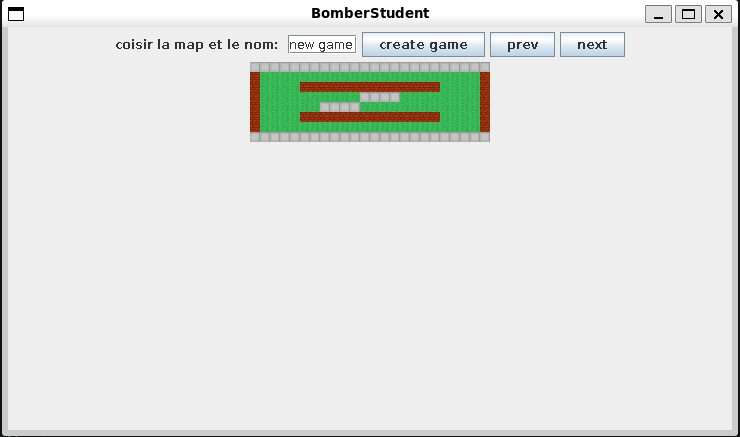

# Bomberman Multiplayer

[Home](../../README.md)
## Java (Swing, UDP Networking) – LAN Game – School Project – 2023

This project was built as part of a networking course, where the challenge was to create a real-time multiplayer game with custom server-client architecture. I chose to recreate a Bomberman-style game with support for multiple simultaneous matches, and implemented both the game logic and the networking layer from scratch using Java.

The game uses Java Swing for visuals and Java’s built-in networking libraries (java.net) alongside Jackson for JSON-based communication. The network layer was built on UDP, which proved to be one of the more complex aspects of the project. While it worked well enough for a LAN environment, ensuring reliable message delivery and synchronization without the overhead of TCP introduced several challenges—especially in keeping game state consistent across all clients.

From a feature standpoint, the server can (theoretically) host multiple concurrent games, and clients can discover available servers on the LAN, browse ongoing games, and either create or join matches. Each match supports free movement on a grid-based level, with the ability to place three types of bombs:
- Classic bombs: explode after a timer.
- Remote bombs: detonate on command.
- Mines: invisible to all players except the one who placed them, triggered on contact.

The explosions can destroy brick walls, some of which drop power-ups—including increased or decreased explosion radius, temporary invincibility, extra bombs, and instant full health. The game logic includes movement, health systems, win conditions, and dynamic item pickups.

I handled everything myself, including all core systems, mechanics, and visuals (the level layouts were provided in the assignment). There was no audio implementation, but the game was fully playable and functional. The whole development process lasted around three months, starting in October 2023.

If I were to revisit the project, I’d move away from UDP in favor of TCP or a higher-level networking library to ensure better reliability, and I’d likely build it in Unity or Unreal Engine to push the visuals further and streamline development. That said, for a self-made game with real-time multiplayer using only low-level tools, I’m proud of how well it turned out.

## Assets

## screenshots

Game/server selection:

Map 1:

Map 2 with 2 player:

