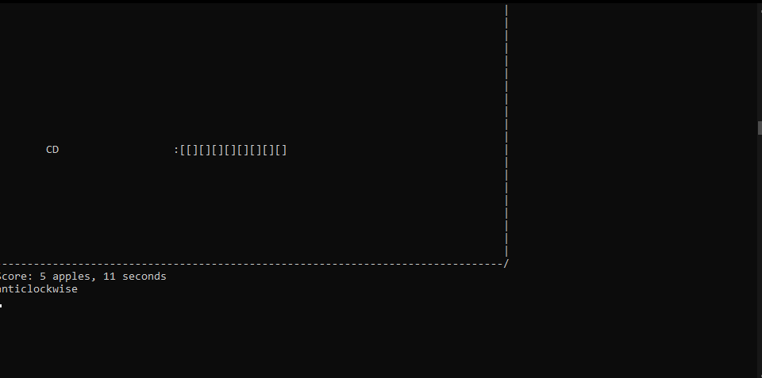

# Snake Pseudo-AI

## Java – Terminal Game – Personal Project – 2021

This project was a personal challenge inspired by the YouTuber CodeBullet’s infamous Snake AI. I wanted to create my own self-playing version of Snake from scratch, and in doing so, I explored rule-based logic, AI behavior, and good old-fashioned problem-solving.

The game was fully coded in Java using only the basic standard libraries. I built both the Snake game and the AI from the ground up, with no GUI, everything was rendered directly in the terminal window. The snake body was represented using ASCII characters like "[]" for body segments, and different characters for the head ("]:", ":[, or "00") depending on its direction. Apples were shown with "CD".

The AI was entirely automated and operated through a rule-based system—it followed a set of hardcoded movement rules to navigate the grid, seek out apples, and avoid crashing into its own tail. There was no player interaction; once launched, the snake would play on its own.

One of the most frustrating and interesting problems I encountered was what I called the “Sigma case”, a specific snake body configuration resembling the Greek letter σ, which would often cause the AI to make poor decisions and crash when the snake grew long enough. This edge case consistently tripped up the rule system and proved extremely difficult to handle gracefully.

While the AI could usually collect several dozen apples before failing, it was far from perfect. The challenge of dealing with these rule exceptions made me realize the limitations of my approach. If I were to revisit this project today, I’d likely replace the rule-based logic with a pathfinding algorithm, such as A* or BFS, to give the AI actual spatial awareness and more flexible decision-making.

This project helped me get a better understanding of how small AI systems can be built, how fragile they can be under edge cases, and just how fun it is to watch something you coded play a game on its own—even in a terminal window.

## Screenshot
