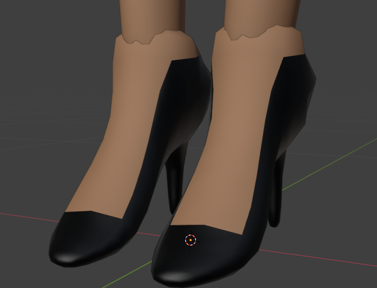
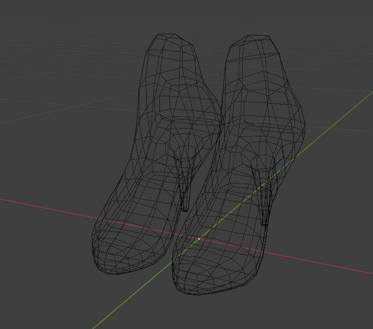

# Blender Character Model – Cyn (Murder Drones Fan Project)

## Blender – Custom Rig – Ongoing Solo Project – 2024–now

This project is a detailed fan recreation of Cyn, a character from the indie web series Murder Drones by Glitch Productions. It began as a way to explore various aspects of character modeling and rigging in Blender, and over time evolved into a full-featured learning project with the goal of producing a model that is ultimately animation-ready.

So far, I’ve focused primarily on modeling and rigging, with materials and texturing coming later. The model currently uses placeholder procedural shaders created in the Blender shader editor, which will be replaced with hand-painted or PBR textures once the rig is finalized.

One of the highlights of the project is the entirely custom rig, which I built from the ground up based on features I liked in Rigify—such as IK/FK switching, finger controls, and clean limb setups—but implemented entirely on my own without relying on auto-rigging systems. I also created a test scene within the project file which contains all the setup experiments and tests I ran to develop and refine the rig.
Custom Scripted Controls:

- IK/FK Switches: Functional on both arms and legs, with intuitive snapping.

- Eye Expression System: The character’s eyes are shapes on a screen; I built a control panel that allows swapping between different expressions using drivers and custom properties.

- Dual-Hand Linking: Cyn has four hands—two primary and two secondary. A toggle allows the secondary hands to mimic the pose of the main ones for synced animation.

While building the rig, I ran into several technical challenges—especially with eye shape switching and the weight painting, which proved especially finicky around the face. The mouth rig is still a work in progress, and has been one of the more complex systems to design cleanly. The hair modeling, while not particularly difficult, has been time-consuming to block out and refine.

This model has been in progress on and off over the past five months, and has taught me a ton about blocking, proportions, retopology, rigging, and driver-based control systems. I’m particularly proud of how far I’ve come without relying on tutorials, just trial, error, and a solid foundation of Blender basics.
Next Steps:

- Finish the mouth rig and finalize the face deformations

- Add screen-accurate accessories and polish silhouette details

- Replace placeholder materials with final textures

- Begin test animation cycles using the rig

This project has not only sharpened my modeling and rigging workflow, it’s also helped me build confidence in solving complex technical challenges on my own.

## a little history of the model

### official model and concept art of Cyn used as references: 

*extras*

Why i find the face so complicated:

- from wide toothy grin taking up the whole bottom part of the face

- to small close lips

- it can also move to the sides

### History of the model

first blockouts:

start of the legs:

adding more details to the curves i used for the hair:

fixing the feets: 
 - model view:

 - wireframe view:
 

 starting the details:

adjusting proportions (skint tone proportions are the adjusted version): 

 start of retopology (blockout is hiddden):

 The first version is complete (made with a bic mixamo rig just to test how the model felt):

teeths upgrade (old vs new):

shape keys control for the teeths:

the first version of the eyes: 

the topology at this point (red lines are the seams for UV mapping):

a small change but one i wanted to do for a while (made with ibis paint):

new robot hands!:

the rings on the finger are there for accuracy with the source material and are toggleable via shapekeys for close up shots

chest icon v2 (made with illustrator):

new test render with a few miscelanous additions, such as:
 - Null orb (one of Cyn's the main power )
 - black hole(no real reason)
 - Absolute solver symbol (Cyn's power/icon also there for lighting purposes)

 

 Start of the rig:
- red for IK
- blue for FK
- absolute solver shape as root
- inspired by the rigify rig but entirely custom made
- control panel with FK/IK switch for all limbs

*extra: modeled and rigged the tentacle she has:*

trying rigs configuarion for the mouth using bendy bones:

*extra: hand tentacle from episode 2, and callback ping scene*

*extra: start on the core*

the new and improved rig control panel:

rigging issues: 

fixed issue 1:

*extra: progress on the core:*

