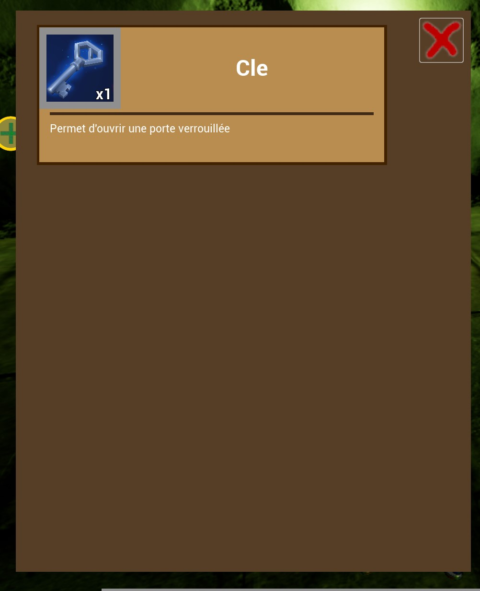
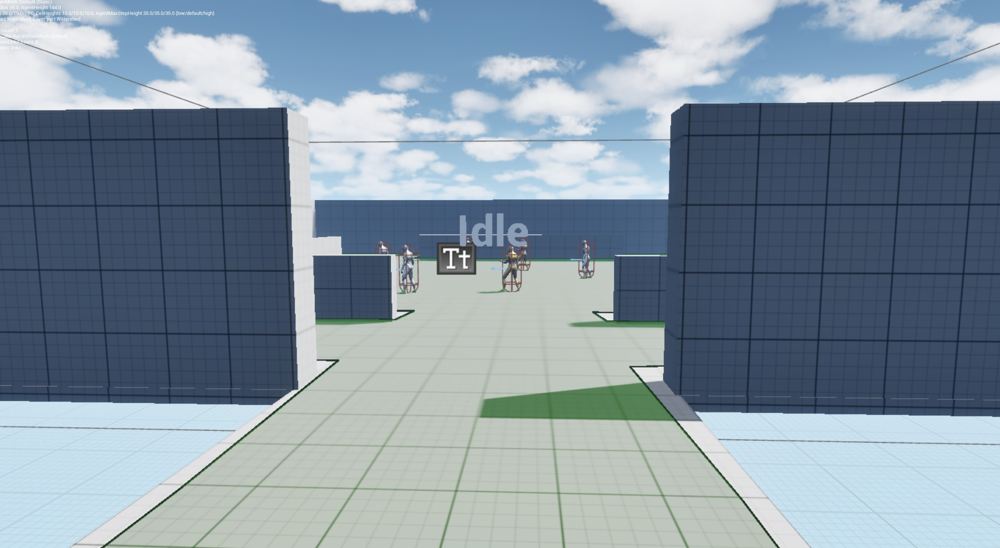

# MMORPG Prototype – AI Behavior & Quest System

## Unreal Engine 5 – Blueprint (Porting to C++) – Team Project – Ongoing (Since Oct 2024)

This project is an early-stage prototype for a multiplayer RPG developed in collaboration with another teammate. My primary responsibility is designing and implementing the AI behavior systems as well as a dialogue and quest framework for NPCs.

The enemy AI is built using Unreal Engine’s Behavior Trees and Blackboards. I’ve developed two main AI types, melee (sword-wielding) and ranged (crossbow-wielding), each with their own behavior tree. Both are derived from a  base behavior tree that can be extended for other types of NPCs. One of the trickier challenges was getting the EQS (Environment Query System) working properly, especially for routines where the enemy attempts to search for the player after losing sight, something that required a bit of experimentation with the different percetions systems.

On top of AI, I built a first-pass dialogue and quest system, currently data-driven through Unreal Data Tables. It supports branching dialogue paths and  quest objectives, with plans to add conditional logic in the next iteration. As we transition the project from Blueprint to C++, I intend to rebuild the system to be either text file-based or node-based, aiming for a more flexible and scalable design as the current design is not very user friendly for the addition and modification of dialogs and quests.

Although the project is still somewhere between early concept and prototype, I’m proud of how much depth the enemy AI already has. Developing the system helped me become comfortable with animation blueprints, blendspaces, and montages, and gave me confidence in my ability to create modular, reusable behavior trees.

In the future, I plan to expand the AI with more enemy types and complex behaviors, and completely refactor the dialogue system to be more robust and more user freindly. This project has been a fantastic opportunity to push deeper into systems design within UE5, especially as I move more into C++-based development.

## Screenshots

### main gameplay

The test dungeon:

The stat menu:

The skill selection window:

Inventory:

Spell selction:

### enemy behavior test map

The four behavior demonstrated in this map are:

Patrolling:

In here the enemy follows along a patrol route going around the central block.

Idle:

In here the enemies stand idle as long as they don't see a potential target.

Wandering:

The NPCs from this area all have a random wandering behavior.

Infighting

It is possible to declare "teams" for the NPCs causing them to fight against each others

### Dialog/quest system

Linear dialog:

---

Non linear: 

- Answer "bad"

- Answer "good"

---

Optional quests:

---

Mandatory quest:

---

Quest progress:

---

Quest completed:

