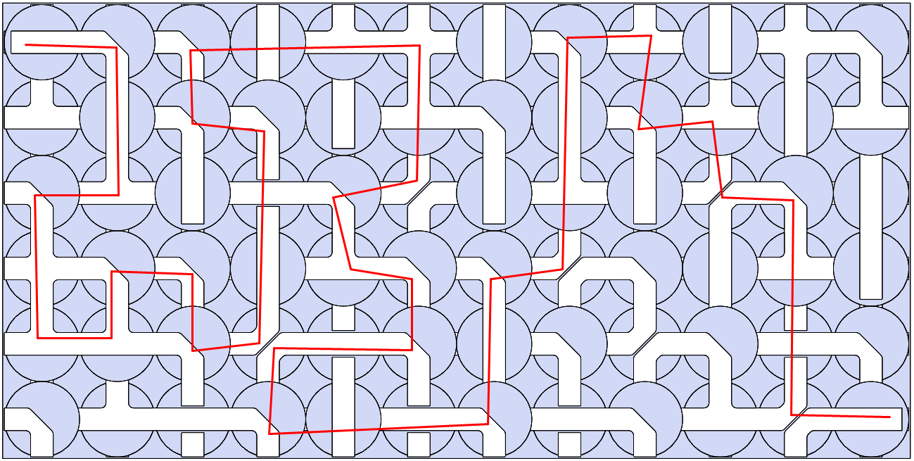
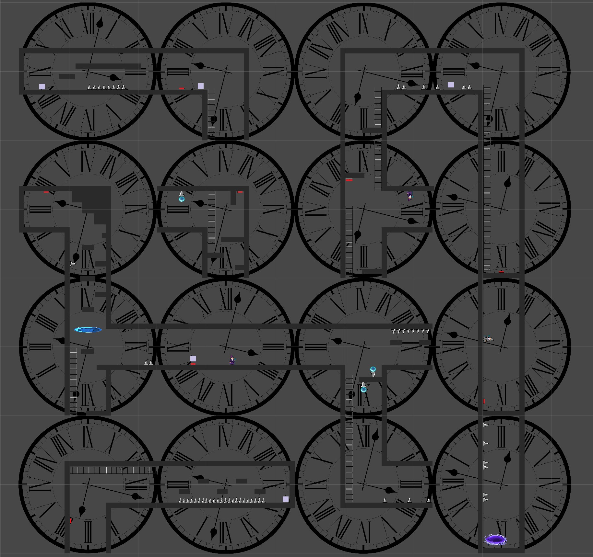
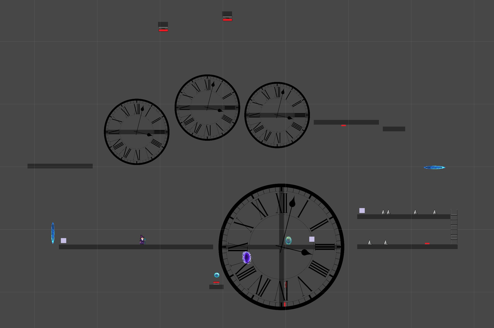
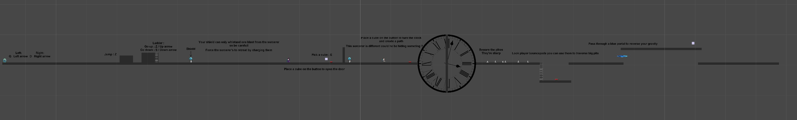

# Spin the Clock

## Unity – 2D Puzzle Platformer – School Project – 2020

Spin the Clock was my very first team-based game project—a 2D puzzle platformer developed as a school assignment during the early days of the COVID-19 lockdown. The core mechanic revolved around manipulating the level layout to create paths to the exit, the inspiration for this were what we refered to as "pipe puzzles" where you'd need to rotate pipes to create a water flow.

I worked on level design and gameplay mechanics, creating the game's second level as well as the tutorial. I also implemented a custom drop mechanic, where certain enemies would drop weighted boxes that could activate buttons and open paths (like those found in Portal). This added another layer of interaction to the puzzles.

We were a team of five students, and collaboration was a challenge in itself—especially without experience in version control tools like Git. We had to coordinate development through Google Drive, which wasn’t ideal for Unity projects and led to some issues with syncing and overwriting changes. In the end, three of us contributed to the final playable build, which was completed over the course of two months.

Looking back, I’m still proud of what we managed to pull off given the situation and our limited experience. That said, Spin the Clock is a project I’d love to revisit one day. The original version had a mix of inconsistent themes—a steampunk robot protagonist battling laser-wielding wizards in a world of giant rotating clocks floating in a white void, ending in a strange chase sequence. While quirky, it lacked cohesion.

With the skills I’ve gained since then, I’d overhaul the art direction, narrative, and mechanics to give the game a stronger identity and more engaging level design. It was a messy start, but it lit the spark—and taught me a lot about working in teams, solving design problems, and finishing a project under tough conditions.

## Screenshots
Original map concept:

In editor screenshot:

